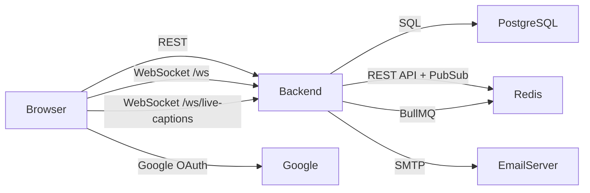

# ARCHITECTURE.md

## 1. OVERVIEW

A WebRTC video conferencing application with a React single-page frontend and an Express backend. Users authenticate via email/password or Google OAuth, create/join rooms, and communicate via real-time audio/video using peer-to-peer mesh WebRTC. Signaling (SDP offers/answers, ICE candidates) routes through a WebSocket server backed by Redis pub/sub. Persistent data (users, rooms, messages, sessions) lives in PostgreSQL via Drizzle ORM. The system targets deployment on Render with Docker.

## 2. TECH STACK

### Frontend (`frontend/`)

| Library | Version | Source |
|---------|---------|--------|
| React | `^19.2.7` | `frontend/package.json:41` |
| React DOM | `^19.2.7` | `frontend/package.json:43` |
| React Router DOM | `^7.17.0` | `frontend/package.json:46` |
| TypeScript | `~6.0.3` | `frontend/package.json:69` |
| Vite | `^8.0.16` | `frontend/package.json:71` |
| Tailwind CSS | `^4.3.0` | `frontend/package.json:50` |
| Jotai | `^2.20.0` | `frontend/package.json:37` |
| Sentry React | `^10.63.0` | `frontend/package.json:27` |
| Sentry Vite Plugin | `^5.3.0` | `frontend/package.json:28` |
| GSAP | `^3.15.0` | `frontend/package.json:35` |
| Zod | `^4.4.3` | `frontend/package.json:52` |
| React Hook Form | `^7.77.0` | `frontend/package.json:44` |

### Backend (`backend/`)

| Library | Version | Source |
|---------|---------|--------|
| Express | `^5.2.1` | `backend/package.json:63` |
| Bun | `^1.3.14` (types) | `backend/package.json:26` |
| TypeScript | `^6.0.3` (peer) | `backend/package.json:43` |
| Drizzle ORM | `^0.45.2` | `backend/package.json:61` |
| Drizzle Kit | `^0.31.10` | `backend/package.json:60` |
| postgres.js | `^3.4.9` | `backend/package.json:76` |
| Upstash Redis | `^1.38.0` | `backend/package.json:52` |
| ws (WebSocket) | `^8.21.0` | `backend/package.json:79` |
| jsonwebtoken | `^9.0.3` | `backend/package.json:67` |
| Passport | `^0.7.0` | `backend/package.json:73` |
| Passport Google OAuth | `^2.0.0` | `backend/package.json:74` |
| bcrypt | `^6.0.0` | `backend/package.json:53` |
| BullMQ | `^5.78.0` | `backend/package.json:55` |
| Deepgram SDK | `^5.4.0` | `backend/package.json:46` |
| Nodemailer | `^8.0.10` | `backend/package.json:72` |
| Helmet | `^8.2.0` | `backend/package.json:68` |
| express-rate-limit | `^8.5.2` | `backend/package.json:64` |
| rate-limit-redis | `^4.3.1` | `backend/package.json:77` |
| sharp | `^0.34.5` | `backend/package.json:78` |
| Multer | `^2.1.1` | `backend/package.json:69` |
| Bloom Filters | `^3.0.4` | `backend/package.json:54` |
| OTPLib | `^13.4.1` | `backend/package.json:70` |
| QRCode | `^1.5.4` | `backend/package.json:75` |
| Archiver | `^7.0.1` | `backend/package.json:51` |
| isomorphic-dompurify | `^3.16.0` | `backend/package.json:69` |
| geoip-lite | `^2.0.2` | `backend/package.json:65` |
| ua-parser-js | `^2.0.10` | `backend/package.json:79` |
| dotenv | `^17.4.2` | `backend/package.json:59` |

### Infrastructure

| Component | Technology | Evidence |
|-----------|-----------|----------|
| Database | PostgreSQL | `backend/src/db/index.ts:6` — `DATABASE_URL` |
| Cache / Pub-Sub | Upstash Redis (REST) | `backend/src/config/redis.ts:1-7` |
| Queue | BullMQ over Redis | `backend/src/jobs/recording-worker.ts:1,27` |
| Container Runtime | Bun on Alpine | `backend/Dockerfile:1` — `oven/bun:1-alpine` |
| Static Serving | Nginx | `frontend/Dockerfile:16` — `nginx:alpine` |
| CI/CD | GitHub Actions | `.github/workflows/ci.yml`, `.github/workflows/deploy.yml` |
| Hosting | Render (backend), Docker Compose (prod) | `render.yaml:1-9`, `docker-compose.prod.yml` |

## 3. HIGH-LEVEL ARCHITECTURE / CODEMAP

```
basic-webrtc-app/
├── frontend/                    # React SPA (Vite + Tailwind + Jotai)
│   ├── src/
│   │   ├── pages/               # Route-level components (17 pages)
│   │   ├── components/          # Reusable UI components
│   │   │   ├── ui/              # shadcn/ui primitives (47 components)
│   │   │   └── room/            # In-call UI (VideoGrid, ControlBar, Chat, etc.)
│   │   ├── lib/                 # Core client logic
│   │   │   ├── rtc-manager.ts   # WebRTC peer connection management
│   │   │   ├── ws-manager.ts    # WebSocket signaling client
│   │   │   ├── media-manager.ts # Camera/mic/screen capture
│   │   │   ├── RecordingManager.ts # Client-side recording (IndexedDB)
│   │   │   ├── api.ts           # REST API client (fetch wrapper)
│   │   │   ├── signal-handler.ts # WebRTC signal dispatch
│   │   │   └── live-captions.ts # Browser/Deepgram/Whisper STT
│   │   ├── store/               # Jotai atoms (global state)
│   │   ├── instrument.ts        # Sentry SDK init (loaded first)
│   │   └── main.tsx             # Entry point (React 19 createRoot)
│   ├── vite.config.ts           # Vite + Sentry plugin
│   └── Dockerfile               # Multi-stage: Bun build → Nginx serve
│
├── backend/                     # Express + WebSocket server (Bun runtime)
│   ├── src/
│   │   ├── server.ts            # Entry: Express, HTTP upgrade, WS servers
│   │   ├── routes/              # REST API handlers
│   │   │   ├── auth.ts          # Signup/login/logout/2FA (2946 lines)
│   │   │   ├── rooms.ts         # Room CRUD, join/leave, invitations
│   │   │   ├── account.ts       # Profile, sessions, data export, deletion
│   │   │   ├── recordings.ts    # Recording metadata status
│   │   │   ├── ice.ts           # STUN/TURN server config
│   │   │   ├── oauth.ts         # Google OAuth flow
│   │   │   └── health.ts        # Liveness + readiness probes
│   │   ├── websocket/
│   │   │   ├── handler.ts       # Main WS handler: rooms, heartbeat, Redis sub
│   │   │   ├── handlers/        # Signal dispatch (WebRTC, chat, admin, media)
│   │   │   └── live-captions-bridge.ts # Deepgram proxy WS
│   │   ├── db/
│   │   │   ├── index.ts         # Postgres.js + Drizzle client
│   │   │   └── schema.ts        # 12 tables (users, rooms, messages, etc.)
│   │   ├── lib/
│   │   │   ├── redis-rooms.ts   # Room state in Redis (peers, roles, settings)
│   │   │   ├── redis-streams.ts # Redis Streams for durable signal log
│   │   │   ├── signals.ts       # Signal type definitions
│   │   │   ├── rate-limiters.ts # Express rate limiters (Redis-backed)
│   │   │   └── cleanup-job.ts   # Stale room cleanup
│   │   ├── services/            # Business logic
│   │   │   ├── auth.ts          # Signup/login logic
│   │   │   ├── session.ts       # Session tracking (Postgres + Redis)
│   │   │   ├── otp.ts           # OTP generation/verification
│   │   │   ├── two-factor.ts    # TOTP 2FA setup/verify
│   │   │   ├── email.ts         # Nodemailer templates
│   │   │   ├── login-analyzer.ts # Suspicious login detection
│   │   │   └── recording-broadcast.ts # Recording state tracking
│   │   ├── jobs/                # BullMQ workers
│   │   │   ├── recording-worker.ts # Recording state transitions
│   │   │   ├── export-worker.ts # GDPR data export
│   │   │   └── deletion-worker.ts # Account deletion
│   │   ├── middleware/
│   │   │   ├── auth.ts          # JWT verification + session validation
│   │   │   ├── security.ts      # Helmet CSP headers
│   │   │   └── verified-email.ts # Email verification gate
│   │   ├── config/
│   │   │   ├── redis.ts         # Upstash client, session/blocklist helpers
│   │   │   ├── passport.ts      # Google OAuth strategy
│   │   │   └── scaling.ts       # DB pool, trust proxy, WS frame limits
│   │   ├── utils/               # JWT, validation, bloom filter, crypto
│   │   └── types/               # Shared TypeScript types
│   ├── drizzle/                 # SQL migrations
│   └── Dockerfile               # Single-stage: Bun runs src/server.ts
│
├── docker-compose.yml           # Dev: postgres + redis + backend + frontend
├── docker-compose.prod.yml      # Prod: same services, env-file driven
└── render.yaml                  # Render deployment manifest
```

**CONFIRMED** — every path above verified via directory listings and file reads.

### How the pieces connect



## 4. DATA MODEL

**Database**: PostgreSQL, accessed via Drizzle ORM (`backend/src/db/schema.ts`).

### Core Tables

| Table | PK | Key Relationships | Purpose |
|-------|----|-------------------|---------|
| `users` | `uuid` | — | User accounts, 2FA, recovery |
| `rooms` | `varchar(10)` | `host_id → users.id` | Meeting rooms |
| `room_participants` | `uuid` | `room_id → rooms.id`, `user_id → users.id` | Room membership + roles |
| `messages` | `uuid` | `room_id → rooms.id`, `user_id → users.id` | In-room chat |
| `room_settings` | `varchar(10)` | `room_id → rooms.id` | Per-room permissions |
| `recording_sessions` | `uuid` | `room_id → rooms.id`, `started_by → users.id` | Recording metadata |
| `recording_tracks` | `uuid` | `session_id → recording_sessions.id` | Per-track status |
| `otp_codes` | `uuid` | — | Email verification OTPs |
| `backup_codes` | `uuid` | `user_id → users.id` | 2FA backup codes |
| `user_sessions` | `uuid` | `user_id → users.id` | Active session tracking |
| `login_events` | `uuid` | `user_id → users.id`, `session_id → user_sessions.id` | Login audit log |
| `password_reset_tokens` | `uuid` | `user_id → users.id` | Password reset flow |
| `deletion_requests` | `uuid` | `user_id → users.id` | GDPR deletion queue |

### Redis Data Structures

Redis (Upstash) holds ephemeral/real-time state — **not** a second database. Key patterns (from `backend/src/lib/redis-rooms.ts`):

| Key Pattern | Type | Purpose |
|-------------|------|---------|
| `room:{id}:participants` | Set | Connected peer user IDs |
| `room:{id}:peers` | Hash | Per-peer metadata (video/audio/screen state) |
| `room:{id}:roles` | Hash | Per-peer roles (host/co-host/participant) |
| `room:{id}:locked` | String | Room lock state |
| `room:{id}:recording` | String (JSON) | Recording state machine |
| `room:{id}:settings:reactions` | String | Reactions enabled flag |
| `room:{id}:activeSpeaker` | String | Active speaker user ID |
| `room:{id}:kicked` | Set | Kicked user IDs (TTL-based) |
| `room:{id}:forceMuted` | Set | Force-muted user IDs |
| `room:chatBuffer:{id}` | List | Write-ahead chat buffer |
| `signals:{roomId}` | Stream | Durable signal log (trimmed to 500) |
| `user:{id}:session` | String | Current refresh token hash |
| `user:{id}:session:invalid_before` | String | Session invalidation timestamp |
| `blocklist:{token}` | String | Revoked token blocklist |
| `ratelimit:{prefix}:{ip}` | Sorted Set | Rate limit counters |
| `session:{hash}` | String (JSON) | Session metadata (device, IP, location) |

## 5. REQUEST / DATA FLOW

### Flow 1: User Login

```
1. POST /api/auth/login  (email + password)
   → authLimiter rate check
   → bcrypt.compare(password, user.passwordHash)
   → check failedLoginAttempts / lockout
   → analyzeLogin() — geoip, device fingerprint, suspicious detection
   → generateAccessToken({ userId, email }) + generateRefreshToken({ userId, email })
   → createSessionForAccessToken() — store session in user_sessions table + Redis
   → setRefreshSession() — Redis key user:{id}:session with 7-day TTL
   → setRefreshSession() — Redis key user:{id}:session with 7-day TTL
   → Set-Cookie: refresh_token (HTTP-only, secure)
   → Return { accessToken, user }
```

**CONFIRMED** — traced through `backend/src/routes/auth.ts` lines 80-300 and `backend/src/services/auth.ts`.

### Flow 2: Join a Room and Start WebRTC

```
1. POST /api/rooms/:id/join  → validates room exists, checks passcode/lock/waiting room
   → generateRoomToken(userId, roomId) — JWT with 2h expiry
   → Returns { roomToken, room }

2. Frontend: RoomPage mounts → MediaManager.getStream() → getUserMedia()
   → RTCManager.setLocalStream(stream)
   → WSManager.connect(roomToken) → WebSocket upgrade at /ws

3. Backend server.ts upgrade handler:
   → verifyRoomToken(token) → attach userId/roomId to socket
   → WebSocketHandler constructor subscribes to Redis psubscribe room:*:signal

4. On join: handler.ts publishes { type: "join", user } to Redis
   → All other sockets in room receive join
   → Greater userId sends offer (lexicographic tiebreaker)

5. WebRTC signaling: offer → answer → ICE trickle
   → All via Redis pub/sub fan-out (not Redis Streams)
   → RTCManager queues ICE candidates until setRemoteDescription completes
```

**CONFIRMED** — traced through `backend/src/server.ts:115-165`, `backend/src/websocket/handler.ts:61-100`, `frontend/src/lib/ws-manager.ts:30-38`, `frontend/src/lib/rtc-manager.ts:1-57`, and `CONTEXT.md`.

### Flow 3: Client-Side Recording

```
1. Host toggles record → WS: { type: "recording_start" }
   → handler.ts: startRoomRecording() → setRecordingState() in Redis + DB
   → Broadcasts recording_start to all clients

2. Each client: RoomPage effect → lazy-import RecordingManager
   → new RecordingManager().startRecording(localMedia.stream, key)
   → MediaRecorder collects chunks in memory

3. Host stops → WS: { type: "recording_stop" }
   → Each client: recordingManager.stopAndSave() → IndexedDB
   → Download button appears in UI header
```

**CONFIRMED** — traced through `backend/src/websocket/handler.ts:747-807`, `frontend/src/pages/RoomPage.tsx:457-530`, `frontend/src/lib/RecordingManager.ts`.

## 6. AUTHENTICATION & AUTHORIZATION

### Token System

Three distinct JWT types, all in `backend/src/utils/jwt.ts`:

| Token | Secret | Default Expiry | Purpose |
|-------|--------|----------------|---------|
| Access token | `JWT_SECRET` | 15m | API authentication |
| Refresh token | `JWT_REFRESH_SECRET` | 7d | Token renewal |
| Room token | `JWT_ROOM_SECRET` (falls back to `JWT_SECRET`) | 2h | WebSocket + room access |

### Access Token Flow

1. Login/signup returns short-lived access token in response body
2. Frontend stores in memory (`api.ts:11` — `let accessToken: string | null`)
3. `api.ts` attaches `Authorization: Bearer {token}` to every request
4. `authenticateToken` middleware (`middleware/auth.ts:92-94`) calls `authenticate()`
5. `authenticate()` verifies JWT, then validates session hash against Redis (`validateSessionToken`)
6. Session activity is debounced (`touchSessionActivity` — 5-minute window)

### Refresh Token Flow

1. Stored as HTTP-only cookie (set by `auth.ts` route handler)
2. Hash stored in Redis at `user:{userId}:session` with 7-day TTL
3. On refresh: verify JWT → compare hash with Redis → rotate both tokens
4. On logout: `logoutRevoke()` deletes Redis key + revokes session in DB

### Room Authorization

- Room tokens are verified during WebSocket upgrade (`server.ts:120`) and REST calls (`rooms.ts`)
- Roles (host/co-host/participant) stored in Redis hash `room:{id}:roles`
- `getPeerRole()` checked before admin actions (`handlers/index.ts`)
- Waiting room: token includes `waiting: true` flag; limited API access until admitted

### Additional Security

- **Rate limiting**: Redis-backed `express-rate-limit` with separate limiters for global (200/min), auth (30/15min), login (10/15min), API (120/min) — `backend/src/lib/rate-limiters.ts`
- **Bloom filter**: Username uniqueness check on signup using `bloom-filters` package — `backend/src/utils/bloomFilter.ts`
- **2FA**: TOTP via `otplib`, backup codes, recovery email — `backend/src/services/two-factor.ts`
- **Suspicious login detection**: geoip + device fingerprinting, email alerts — `backend/src/services/login-analyzer.ts`
- **Helmet**: CSP headers configured in `backend/src/middleware/security.ts`
- **CORS**: Configurable via `ALLOWED_ORIGINS` env var — `server.ts:40`

## 7. EXTERNAL DEPENDENCIES & INTEGRATIONS

| Service | Package | Usage | Config Location |
|---------|---------|-------|-----------------|
| Google OAuth | `passport-google-oauth20` `^2.0.0` | Social login + account linking | `backend/src/config/passport.ts` |
| Deepgram | `@deepgram/sdk` `^5.4.0` | Live speech-to-text captions | `backend/src/websocket/live-captions-bridge.ts` |
| Nodemailer | `nodemailer` `^8.0.10` | Transactional emails (OTP, verification, alerts) | `backend/src/services/email.ts` — SMTP config via env |
| Sentry | `@sentry/react` `^10.63.0` | Error monitoring + session replay | `frontend/src/instrument.ts` |
| hCaptcha | `@hcaptcha/react-hcaptcha` `^2.0.2` | Bot protection | Used in frontend auth pages |
| GeoIP | `geoip-lite` `^2.0.2` | IP geolocation for login analysis | `backend/src/services/session.ts`, `login-analyzer.ts` |
| Sharp | `sharp` `^0.34.5` | Avatar image processing | `backend/src/routes/auth.ts` |

**All external API keys are env-var driven** — no hardcoded secrets found in source. Confirmed by reading `.env.example` and route files.

## 8. INFRASTRUCTURE & DEPLOYMENT

### Docker

**Backend** (`backend/Dockerfile`): Single-stage `oven/bun:1-alpine`, runs `bun run src/server.ts` directly (no build step). This avoids the `css-tree` / `patch.json` bundling issue.

**Frontend** (`frontend/Dockerfile`): Multi-stage — Bun builds Vite output, then copies `dist/` to `nginx:alpine` for serving on port 3000.

### CI/CD (`.github/workflows/`)

**ci.yml** — runs on push/PR to `main`:
- Backend: `bun install` → `tsc --noEmit` → `bun run test`
- Frontend: `bun install` → `tsc --noEmit` → `bun run test` → `bun run build`
- Docker: builds both images (only on `main`)

**deploy.yml** — runs on push to `main`:
- Tests, then SSH deploys to a server at `/var/www/webrtc-meet` using `docker-compose.prod.yml`

### Render (`render.yaml`)

```yaml
services:
  - type: web
    name: backend
    runtime: docker
    dockerfilePath: backend/Dockerfile
    dockerContext: backend
```

### Environment Variables

**Backend** (from `backend/.env.example` and code):
- `DATABASE_URL` — PostgreSQL connection string
- `UPSTASH_REDIS_REST_URL` / `UPSTASH_REDIS_REST_TOKEN` — Redis credentials
- `JWT_SECRET` / `JWT_REFRESH_SECRET` / `JWT_ROOM_SECRET` — signing keys
- `ALLOWED_ORIGINS` — comma-separated CORS origins
- `SMTP_HOST` / `SMTP_PORT` / `SMTP_USER` / `SMTP_PASS` — email
- `GOOGLE_CLIENT_ID` / `GOOGLE_CLIENT_SECRET` — OAuth
- `DEEPGRAM_API_KEY` — live captions
- `STUN_SERVERS` / `TURN_SERVERS` / `TURN_SECRET` — ICE config
- `PORT` (default 4000), `NODE_ENV`, `TRUST_PROXY`, `DATABASE_POOL_MAX`

**Frontend** (from `frontend/.env.sample`):
- `VITE_API_URL` — backend REST origin
- `VITE_WS_URL` — WebSocket origin (defaults to `VITE_API_URL` + `/ws`)
- `VITE_APP_URL` — frontend origin
- `VITE_SENTRY_DSN` — Sentry DSN (optional)
- `VITE_DEEPGRAM_LIVE_CAPTIONS` — enable Deepgram live captions
- `VITE_API_TIMEOUT_MS` — fetch timeout (default 15000)

## 9. KEY ARCHITECTURAL DECISIONS & TRADE-OFFS

### Mesh WebRTC (no SFU/MCU)

**CONFIRMED** — `frontend/src/lib/rtc-manager.ts` creates one `RTCPeerConnection` per remote peer. Each participant sends/receives streams directly to every other participant.

**Product constraint (explicit)**: Maximum **6 participants** per room. Beyond this, O(n²) connections cause:
- Bandwidth saturation (each participant uploads to n-1 peers)
- CPU overload from encoding/decoding multiple streams
- ICE/DTLS handshake storms on join

**If scaling beyond 6 is needed**: Spike a free/cheap SFU (e.g. LiveKit free tier, Mediasoup) as a feature-flagged alternative path. Do not mix into this hardening pass.

**Trade-off**: Simple server (no media relay), but scales poorly beyond ~6 participants due to O(n²) connections and bandwidth.

### Client-Side Recording (no server-side merge)

**CONFIRMED** — `frontend/src/lib/RecordingManager.ts` stores `MediaRecorder` output in IndexedDB. The server only tracks recording metadata (`recordingSessions` table). The `recording-merge.ts` service was deleted; the worker just updates state.

**Trade-off**: Zero server load for recording, but no server-side grid composite or centralized storage. Each participant downloads their own recording individually.

### Redis Pub/Sub for Signaling (not Redis Streams for fan-out)

**CONFIRMED** — `handler.ts` uses `redis.psubscribe('room:*:signal')` for real-time message delivery. `redis-streams.ts` (`publishSignal`) writes to a Stream but is used for **durable signals** (recording state, role changes) — not for WebRTC signaling. Per `CONTEXT.md`: "Signaling uses Redis pub/sub (`this.publish` → `forwardFromRedis`), **not** `publishSignal` streams."

**Trade-off**: Pub/sub is fast but messages are lost if a client is disconnected at the moment of publish. Streams provide durability but are only used for non-critical state.

### Upstash Redis (REST-based)

**CONFIRMED** — `backend/src/config/redis.ts` imports `Redis` from `@upstash/redis` and uses REST URL + token authentication. This is a serverless-friendly Redis-as-a-service, not a self-hosted Redis.

**Trade-off**: No persistent TCP connection; each command is an HTTP request. The `enableAutoPipelining: true` flag mitigates this.

### Bun Runtime (not Node.js)

**CONFIRMED** — Backend Dockerfile uses `oven/bun:1-alpine`. Dev script is `bun --watch src/server.ts`. The CLAUDE.md explicitly says "Default to using Bun instead of Node.js."

**Trade-off**: Faster startup and native TypeScript execution, but some npm packages may have compatibility issues.

### Drizzle ORM (not Prisma)

**CONFIRMED** — `backend/src/db/index.ts` uses `drizzle-orm/postgres-js`. Schema defined in `backend/src/db/schema.ts` with `pgTable` calls.

**Trade-off**: Lighter weight, no code generation step, but less mature ecosystem than Prisma.

## 10. KNOWN GAPS, TECH DEBT, AND CONTRADICTIONS

### Unused Code / Incomplete Features

1. **`recordingTracks` table** (`schema.ts:121-131`) has columns `s3Key`, `durationMs`, `fileSizeBytes`, `errorMessage` — all marked as "Unused currently" in CONTEXT.md. No code writes to these columns after the client-side recording refactor.

2. **`recording-broadcast.ts`** is still imported and called (`recording-worker.ts:4,49`) but the service was simplified. The `clearRecordingStatus` function may still operate on stale Redis keys.

3. **Backend `lint` script** is `echo 'No linter configured'` (`backend/package.json:14`). No ESLint or Biome configured for backend.

4. **`deploy.yml`** uses `appleboy/ssh-action@master` to deploy to a self-hosted server at `/var/www/webrtc-meet` — this is a **different** deployment path from `render.yaml`. Two deployment strategies exist in the repo.

5. **`docker-compose.yml`** (dev) exposes `PORT=4000` and `ALLOWED_ORIGINS=http://localhost:3000` — the frontend in dev mode runs on port 5173 (Vite default), not 3000.

### Inconsistencies Found

6. **`recording_start` signal type** is listed in `signals.ts:38` but the recording start handler (`handler.ts:747`) creates a session in Postgres and sets Redis state. The `signals.ts` type definition does not include `sessionId` as a required field, though the handler sends it.

7. **Rate limiter Redis commands**: `rate-limiters.ts` has a custom `sendCommand` wrapper that handles `EVALSHA`, `EVAL`, `SCRIPT LOAD`, `PTTL`, `DECR`, and `DEL` — but the actual `rate-limit-redis` package may issue additional commands not handled here, which could throw at runtime.

8. **`@types/*` in dependencies** (not devDependencies): `backend/package.json` has `@types/archiver`, `@types/fluent-ffmpeg` (removed but type remains), `@types/multer`, `@types/qrcode`, `@types/ua-parser-js` in `dependencies` instead of `devDependencies`.

### Potential Issues

9. **WebSocket heartbeat**: `handler.ts` uses a 30-second ping/pong heartbeat. Clients that fail to respond are terminated. However, the frontend `ws-manager.ts` does not appear to handle `pong` responses or implement client-side ping — it relies on the browser's built-in WebSocket keepalive.

10. **Session TTL mismatch**: `session.ts:10` sets `DEFAULT_SESSION_TTL_SECONDS = 24 * 60 * 60` (24h), but `config/redis.ts:23` sets refresh session TTL to 7 days (`REFRESH_SESSION_TTL_SEC`). Sessions in the DB can expire before the refresh token does.

## 11. HOW TO VERIFY THIS DOCUMENT

| Claim | Verification |
|-------|-------------|
| React 19.2.7, Vite 8.0.16, Express 5.2.1 | `cat frontend/package.json \| grep -E '"react"\|"vite"'` and `cat backend/package.json \| grep '"express"'` |
| Mesh WebRTC (no SFU) | `grep -r "RTCPeerConnection" frontend/src/lib/rtc-manager.ts` — one PC per peer, no relay |
| Drizzle ORM with postgres.js | `cat backend/src/db/index.ts` — imports `drizzle-orm/postgres-js` |
| Upstash Redis (REST, not TCP) | `cat backend/src/config/redis.ts` — `import { Redis } from '@upstash/redis'` |
| Recording is client-side only | `cat frontend/src/lib/RecordingManager.ts` — stores in IndexedDB, no upload |
| WebSocket upgrade at `/ws` | `cat backend/src/server.ts:115-165` — `path === '/ws'` check |
| JWT with three secret types | `cat backend/src/utils/jwt.ts:5-11` — JWT_SECRET, JWT_REFRESH_SECRET, JWT_ROOM_SECRET |
| BullMQ workers (2 queues) | `ls backend/src/jobs/` — export-worker, deletion-worker (recording is inlined) |
| Sentry with React Router v7 | `cat frontend/src/instrument.ts` — `createRoutesFromChildren`, `matchRoutes` from react-router-dom |
| 12 database tables | `cat backend/src/db/schema.ts` — count `pgTable` definitions |
| Rate limiting via Redis | `cat backend/src/lib/rate-limiters.ts` — `RedisStore` from `rate-limit-redis` |

---

**Last verified**: 2026-07-02, against commit `22eda56`.
