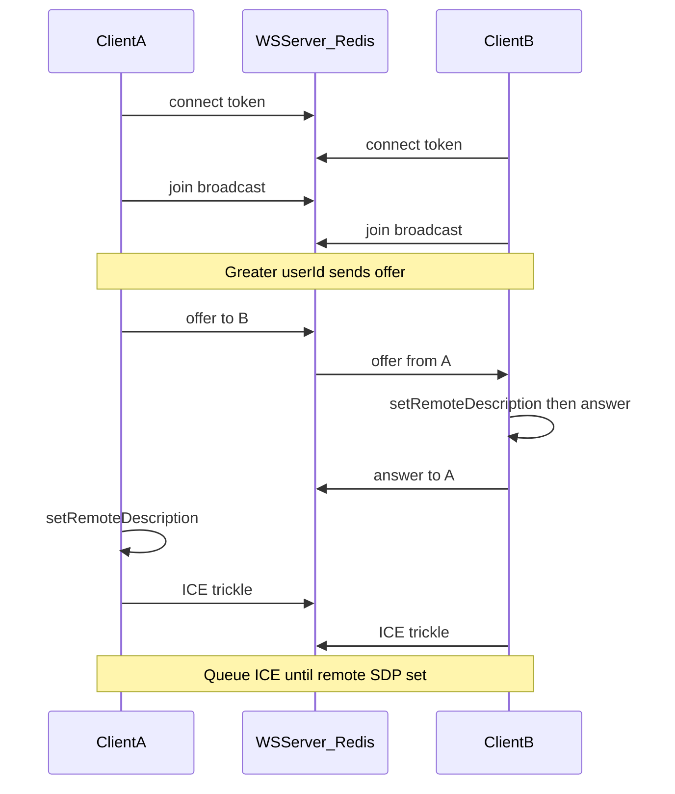

# Repo map & runtime behavior (developer reference)

Quick map of the codebase plus **non-obvious behavior** that affects WebRTC, WebSockets, and the room UI.

## Frontend (`frontend/src`)

### Pages

- **`pages/LobbyPage.tsx`**: Pre-join UI, device preview, `sessionStorage` flags `lobby_video` / `lobby_audio` for `RoomPage`.
- **`pages/RoomPage.tsx`**: In-call lifecycle:
  - Loads media → `RTCManager.setLocalStream` → `WSManager.connect(roomToken)`.
  - Sets **`window.__wsSignal`**: handles **offer / answer / ICE** for WebRTC (signaling is **not** fully handled inside `ws-manager`; it forwards JSON to `__wsSignal` after updating atoms).
  - Cleanup: `WSManager.disconnect`, **`RTCManager.disconnectAll()`**, `MediaManager.stop`, clear atoms.

### WebRTC (`lib/rtc-manager.ts`)

- **ICE trickle race**: Candidates can arrive before `setRemoteDescription` finishes. Those are **queued** in `pendingIceCandidates` and **flushed** after a successful `setRemoteDescription`.
- **Offer/answer ordering**: The callee **must** `await setRemoteDescription(offer)` **before** `createAnswer()`. `RoomPage`’s `__wsSignal` uses an `async` IIFE so these run in order (parallel `void` calls break negotiation).
- **`ontrack` / one remote `MediaStream`**: Browsers differ: audio and video may arrive as **two different `event.streams`** or with **empty `streams`**. The handler **merges** all remote tracks into a **single `MediaStream`** on `peer.stream` (add tracks from alternate streams; fallback `new MediaStream([...tracks, track])` if `addTrack` throws). Otherwise replacing `peer.stream` with a **video-only** stream drops audio (or vice versa). **`peer.video`** is updated when a **live** video track is present.
- **`createOffer`**: Passes **`offerToReceiveAudio` / `offerToReceiveVideo`** (legacy hints) on initial offer, re-ICE, and renegotiation offers so some stacks still open recv **m=** lines correctly when local tracks are missing or ordering is odd.
- **Renegotiation (screen share / late video)**: If a video sender is added after the first negotiation (e.g. camera was off, then **screen share** uses `addTrack`), the browser fires **`negotiationneeded`**. The PC sends a **new offer** to the peer once `remoteDescription` is set and signaling is `stable` (guards avoid colliding with the initial offer/answer).
- **Initial offer role**: In `ws-manager`, only the peer with **lexicographically greater `userId`** calls `createPeer` + `offer` on `join`; the other side waits for that offer.
- **Leave**: `ws-manager` calls **`RTCManager.removePeer(userId)`** on `leave` so connections and ICE state don’t leak.

### Media (`lib/media-manager.ts`)

- Builds **`localStream`** (camera/mic ladder), updates **`localMediaAtom`**, calls `RTCManager.setLocalStream`.
- **Screen share**: `replaceTrack('video', …)` or **`addTrack`** when there was no video sender → triggers **renegotiation** path above.

### WebSocket (`lib/ws-manager.ts`)

- URL: `VITE_WS_URL` or `VITE_API_URL` → `ws` scheme, path **`/ws`**.
- **`intentionalDisconnect`**: avoids a “could not stay connected” toast when leaving on purpose.
- Logs abnormal **`onclose`** / **`onerror`** for debugging misconfigured URLs or TLS.

### UI

- **`components/VideoTile.tsx`**: Shows the `<video>` element if the stream has a **live video track** even when **`media-state` still says camera off** (stale signaling). Re-binds `srcObject` when **track set / state** changes (`streamBindKey`), and calls **`play()`** after bind (autoplay policies). Local mirror uses **`-scale-x-100`** (avoid invalid Tailwind like `transform:scaleX(-1)` as a class string).
- **`components/room/RoomVideoGrid.tsx`**: Wires peer `stream`, `video`, `audio`, `screen` from atoms.

## Backend (`backend/src`)

### Entry

- **`server.ts`**: Express + HTTP upgrade on **`/ws`** with JWT room token; attaches `userId`, `roomId` to the socket.

### WebSocket (`websocket/handler.ts`)

- Signaling uses **Redis pub/sub** (`this.publish` → `forwardFromRedis`), **not** `publishSignal` streams, for messages clients must receive (chat, ICE, offers, **`admin_mute_all`**, **`room_locked`**, **`admin_reactions_toggle`**, etc.).
- **`join`**: Published so other peers get a **`join`** message with `user`; new socket also receives synthetic **`join`**s for peers already in the in-memory room map.

### ICE / TURN

- **`routes/ice.ts`**: Returns `iceServers` (STUN/TURN from env). Frontend **`RTCManager.init()`** loads these before creating peer connections.

## Mental model: one room session

## Recording (`lib/RecordingManager.ts` + `RoomPage.tsx`)

- **Trigger**: Host toggles recording; server broadcasts **`recording_start` / `recording_stop`** via Redis pub/sub; **every** client sets `recordingAtom` and runs the same start/stop logic.
- **Local capture**: `MediaRecorder` on **`localMedia.stream`** (that user’s mic/camera only—not a grid composite).
- **Stream changes while recording**: `startRecording` calls **`discardAndStop()`** first so a **new `MediaStream`** (e.g. camera turned on) **restarts** the recorder. Earlier in-memory chunks for that segment are **discarded** (no multi-file append yet).
- **Mime types**: Prefers **video/webm** (+ VP9/VP8) when a video track exists; falls back to **audio/webm** when audio-only. Final **`Blob`** uses the recorder’s **`mimeType`**.
- **Upload**: Chunks POST to **`/api/recordings/chunk`** with **`Authorization: Bearer <roomToken>`**; IndexedDB backup per chunk; backend worker merges (`services/recording-merge.ts`).
- **RoomPage effect**: Depends on **`[localMedia.stream, recording.active]`**—no `localRecordingRef` guard so **stream replacement** (e.g. `MediaManager.toggleVideo`) can restart capture while `recording.active` stays true.

## Historical fixes (regression hints)

- **Room bootstrap**: Do **not** use a ref that blocks effect re-run after cleanup (e.g. `hasInit` without reset) while the effect depends on changing values—WS and participants would never come back.
- **Admin actions**: Use **`this.publish`** for fan-out to WebSocket clients; **`publishSignal`** (Redis streams) is **not** wired to the WS handler unless separately consumed.
