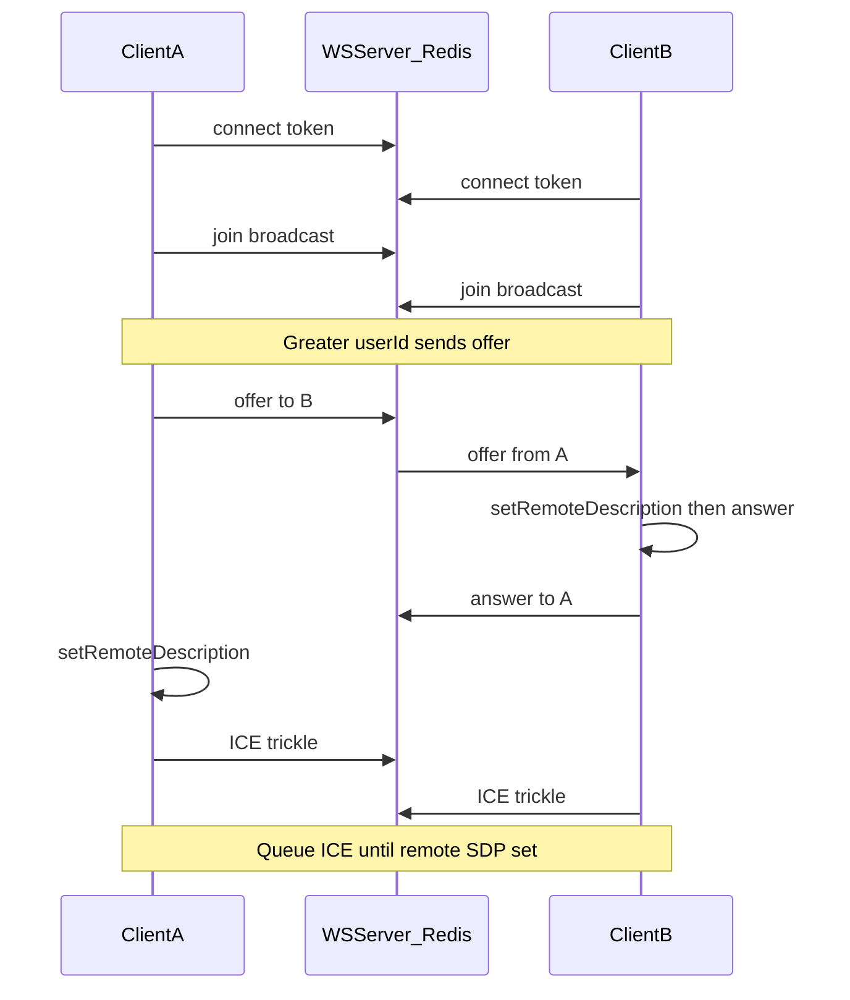

# Repo map & runtime behavior (developer reference)

Quick map of the codebase plus **non-obvious behavior** that affects WebRTC, WebSockets, and the room UI.

## Frontend (`frontend/src`)

### Pages

- **`pages/LobbyPage.tsx`**: Pre-join UI, device preview, `sessionStorage` flags `lobby_video` / `lobby_audio` for `RoomPage`.
- **`pages/RoomPage.tsx`**: In-call lifecycle:
  - Loads media → `RTCManager.setLocalStream` → `WSManager.connect(roomToken)`.
  - Incoming WS JSON is dispatched in `ws-manager`'s `onmessage` chain;
    offer/answer/ICE go to `handleSignal` (`lib/signal-handler.ts`), which runs
    `createPeer → setRemoteDescription → answer` in an `await`ed async IIFE
    (ordering matters — parallel `void` calls break negotiation).
  - Cleanup: `WSManager.disconnect`, **`RTCManager.disconnectAll()`**, `MediaManager.stop`, clear atoms.

### WebRTC (`lib/rtc-manager.ts`)

- **ICE trickle race**: Candidates can arrive before `setRemoteDescription` finishes. Those are **queued** in `PendingIceQueue` (`lib/pending-ice.ts`) and **flushed** after a successful `setRemoteDescription`. The queue and its TTL timer always move together — a separated timer fires against a *later* batch and discards it.
- **Offer/answer ordering**: The callee **must** `await setRemoteDescription(offer)` **before** `createAnswer()`. `RoomPage`’s `__wsSignal` uses an `async` IIFE so these run in order (parallel `void` calls break negotiation).
- **`ontrack` / one remote `MediaStream`**: Browsers differ: audio and video may arrive as **two different `event.streams`** or with **empty `streams`**. The handler **merges** all remote tracks into a **single `MediaStream`** on `peer.stream` (add tracks from alternate streams; fallback `new MediaStream([...tracks, track])` if `addTrack` throws). Otherwise replacing `peer.stream` with a **video-only** stream drops audio (or vice versa). **`peer.video`** is updated when a **live** video track is present.
- **`createOffer`**: Passes **`offerToReceiveAudio` / `offerToReceiveVideo`** (legacy hints) on initial offer, re-ICE, and renegotiation offers so some stacks still open recv **m=** lines correctly when local tracks are missing or ordering is odd.
- **Renegotiation (screen share / late video)**: If a video sender is added after the first negotiation (e.g. camera was off, then **screen share** uses `addTrack`), the browser fires **`negotiationneeded`**. The PC sends a **new offer** to the peer once `remoteDescription` is set and signaling is `stable` (guards avoid colliding with the initial offer/answer).
- **Initial offer role**: In `ws-manager`, only the peer with **lexicographically greater `userId`** calls `createPeer` + `offer` on `join`; the other side waits for that offer.
- **Leave**: `ws-manager` calls **`RTCManager.removePeer(userId)`** on `leave` so connections and ICE state don’t leak.
- **Simulcast (`lib/simulcast.ts`)** is offered on the **first video track** only, and only when the browser accepts `sendEncodings` *and* signals `a=simulcast:send` (probed once, cached). Two invariants that are easy to get wrong:
  - **`sendEncodings` is offer-side only.** Chrome will **not** bind a simulcast transceiver to a **remote** m-line, so on the **answering** side of a link the camera is left on a transceiver that never gets a `mid` (`currentDirection === null`) and **no video is sent at all**. `reconcileVideoSenders` runs inside `setRemoteDescription` (before `createAnswer`), moves the camera onto the m-line that *was* negotiated, and drops the layers for that link. **Degrading to single-layer is correct; degrading to no video is not.** Layers are therefore **asymmetric per link** — in a 3-peer mesh the peer with the greatest id offers to both, the middle one to one, the least to none.
  - A negotiated simulcast sender transmits **only its active encoding**, so the app must promote one. A fresh connection starts on the lowest layer and `updateSimulcastLayers` moves it per connection from that connection's own uplink estimate, capped by `maxLayerForBudget(level.maxBitrateKbps)` from the capture ladder. Unknown bandwidth **holds** the current layer rather than promoting.

> **These invariants are verified against real browsers.** `frontend/e2e/` runs two
> Chromium peers through this module and asserts a real `connected` state, a
> selected ICE pair, live media in both directions, and the `ontrack` merge
> landing in the store. jsdom cannot check any of it. Run `cd frontend && bun run e2e`
> after touching this file.

### Media (`lib/media-manager.ts`)

- Builds **`localStream`** (camera/mic ladder), updates **`localMediaAtom`**, calls `RTCManager.setLocalStream`.
- **Screen share**: `replaceTrack('video', …)` or **`addTrack`** when there was no video sender → triggers **renegotiation** path above.
- The module-level `localStream` is **not** the source of truth for late callers:
  `toggleVideo` / `switchVideoInput` replace the stream, so anything acting on the
  *current* capture (e.g. `applyVideoQuality`) must read `localMediaAtom.stream`.

### Adaptive quality

- **Verified in a real browser** by the `frontend/e2e/` rig (two Chromium peers through
  the production peer module), not just in jsdom — see `frontend/e2e/README.md`.
- **`lib/bandwidth.ts`** decides the ladder rung from measured uplink: degrade
  below 0.9× headroom, climb only at 1.5× over the target, 10s cooldown. A
  quality cap is a **ceiling**, not a floor, and a screen share suspends camera
  adaptation because it owns the uplink.
- The budget is divided by **`RTCManager.getVideoSenderCount()`** — in a mesh the
  same capture is uploaded once per peer, so 1.1 Mbps across 8 peers is ~137 kbps
  per stream, not a comfortable 720p link.
- **`lib/webrtc-stats.ts`** reads `availableOutgoingBitrate` from
  `remote-inbound-rtp`, else the selected/nominated `candidate-pair`.
- **`setVideoMaxBitrate()`** caps each video sender via `setParameters`: capture
  resolution bounds pixels, this bounds the stream congestion control reacts to.
  Never fatal — a sender that rejects keeps its value.

### WebSocket (`lib/ws-manager.ts`)

- URL: `VITE_WS_URL` or `VITE_API_URL` → `ws` scheme, path **`/ws`**.
- **`intentionalDisconnect`**: avoids a “could not stay connected” toast when leaving on purpose.
- Logs abnormal **`onclose`** / **`onerror`** for debugging misconfigured URLs or TLS.
- **Server rate limit** ([`handler.ts`](backend/src/websocket/handler.ts)): ICE / audio-activity / media-state / ping / offers / answers **do not** count toward the per-room burst limit, so they cannot starve **chat** or **captions**. They still have **per-connection token buckets** (`backend/src/lib/rate-limit.ts`, 100/s signalling, 10/s state), plus a **500 msg/s hard cap** that closes the socket with **4008**. Buckets live on the socket object, so there is no per-user map to leak on disconnect.
- **Authorization is server-enforced**: the room token is re-verified on **every** inbound message (local HMAC + expiry, no Redis call) and waiting-room sockets get the same check, so a client cannot outlive its token by skipping `ping`.
- **`admin_promote`**: must be **`this.publish`** with type **`admin_promote`** (not `publishSignal` / `role_changed`) so clients update `participantsAtom` / `canManageAtom`.

### UI / video tile

- **`VideoTile` is `React.memo`-ized** (all props are primitives or stable callbacks). `memo` alone is *not* enough: remote tracks are added to the **same** `MediaStream` object after the first frame, so the tile must also mirror track membership into state via **`addtrack` / `removetrack`** listeners (`trackRevision`). Those events re-run `srcObject` + `play()` **and** re-render, so `showVideo` / `streamBindKey` cannot go stale — without the state bump, a late-arriving video stayed bound but invisible behind the initials placeholder.

### Captions

- **`RoomCaptionsOverlay`**: Renders when **`captionsEnabled`** (local speech-to-text) **or** when there are **incoming** caption lines from WebSocket, so viewers see others’ captions without turning the mic-caption feature on.

### UI

- **`components/VideoTile.tsx`**: Shows the `<video>` element if the stream has a **live video track** even when **`media-state` still says camera off** (stale signaling). Re-binds `srcObject` when **track set / state** changes (`streamBindKey`), and calls **`play()`** after bind (autoplay policies). Local mirror uses **`-scale-x-100`** (avoid invalid Tailwind like `transform:scaleX(-1)` as a class string).
- **`components/room/RoomVideoGrid.tsx`**: Wires peer `stream`, `video`, `audio`, `screen` from atoms.

## Backend (`backend/src`)

### Entry

- **`server.ts`**: Express + HTTP upgrade on **`/ws`** with JWT room token; attaches `userId`, `roomId` to the socket.

### WebSocket (`websocket/handler.ts`)

- Signaling uses **Redis pub/sub** (`this.publish` → `forwardFromRedis`), **not** `publishSignal` streams, for messages clients must receive (chat, ICE, offers, **`admin_mute_all`**, **`room_locked`**, **`admin_reactions_toggle`**, etc.).
- **`join`**: Published so other peers get a **`join`** message with `user`; new socket also receives synthetic **`join`**s for peers already in the in-memory room map.
- **Two publish paths.** Local delivery is always immediate. Cross-node delivery splits:
  `offer` / `answer` / `join` / `leave` and the one-shot `admin_*` control
  messages (`MUST_DELIVER`) publish **straight through** — they are
  unrecoverable if dropped and order-sensitive between the local hop and the
  Redis hop. Everything else goes through the **bounded, circuit-broken
  `PublishBuffer`** (`lib/publish-buffer.ts`, shared with live captions), which
  batches per channel into one MULTI/EXEC every 50ms and drops the oldest past
  1000 queued. **`ice` is buffered deliberately**, not by oversight: candidates
  arrive continuously (up to 100/s per connection), the receiver tolerates
  losing one, and that volume would defeat the circuit breaker. Do not move a
  must-deliver type into the buffer.
- **Disconnect cleanup is one-shot** (`disconnectHandled`) and skips shared-state
  cleanup when a **newer socket has already replaced it** — otherwise a
  reconnecting user's new connection loses its membership and peers are told
  they left. `close`, `error`, and the heartbeat sweep all fire it.
- **Connection setup** is guarded by a `setupFailed` flag: a client that
  disconnects mid-setup (or a Redis failure before the inner `try`) must not end
  up half-added to `this.rooms` with no later event to clean it up.

### Authorization of an inbound message

- The order and the resulting close code are **contract** and live in one pure
  function, `lib/ws-authz.ts` (`authorizeInbound`), so they are testable without
  Redis or Postgres. `websocket/handler.ts` only gathers facts and applies the
  verdict.
- Order: **token expiry** (local HMAC, fails before spending a round trip) →
  **kicked** (Redis, already paid per message) → heartbeat-only **room exists**
  (Redis) and **account has a live session** (`hasActiveSession`, a DB read).
- The last two are gated on the ~25s `ping` because they are the expensive ones.
  That is why token expiry and kick must **not** be gated on it — a client that
  stops pinging is only caught by the per-message checks.
- A lookup that was skipped or failed returns `null` and does **not** close the
  socket: a transient Redis/DB error must never end a live call. Only an explicit
  `false` denies.
- Close codes: 4002 room gone, 4003 kicked, 4004 token expired, 4005 no live
  session. A room token deliberately outlives the 15-minute access token, so
  4005 is what stops a logged-out or revoked account from sitting in a call
  whose REST calls are already failing.
- **Deliberate deviation from the engineering review on C1:** it asked for a
  `ws-heartbeat` client message every 30s. No such message type exists, and that
  is the intended outcome — the per-message check above is strictly *stronger*
  (it runs on every message, not on a cadence the client controls), and the
  server's own 30s sweep revalidates with the same free local HMAC check before
  pinging. What the review wanted — the server noticing a dead token without
  client cooperation — is satisfied by the sweep, so a new client message would
  have been redundant protocol surface.

### Room tokens in a call

- The token is verified on upgrade, **on every inbound message**, and on waiting
  sockets — a client cannot outlive it by skipping `ping`. The client renews
  proactively (`lib/room-token.ts` schedules 5 minutes ahead) and hands the new
  token to the live socket with `token_refresh`.
- `POST /api/rooms/:id/refresh-token` requires **live** admission (current peer
  role or host, room exists, not kicked) — deliberately **not** `canAccessRoom`,
  which admits past participants so they can read the recap and must not imply
  permission to hold a live-call token.
- Anything authenticating *during* a call must read the live token via
  `WSManager.getRoomToken()`; room tokens rotate, so a long-lived uploader that
  captured one at setup goes stale.
- `request()` refreshes the **access** token once on a 401 via the httpOnly
  cookie and replays. Access tokens last 15m and calls last hours; without this
  every authenticated call late in a call failed.

### ICE / TURN

- **`routes/ice.ts`**: Returns `iceServers` (STUN/TURN from env). Frontend **`RTCManager.init()`** loads these before creating peer connections. TURN credentials are short-lived (HMAC, `TURN_TTL_SEC` default 300s), so **`RTCManager.refreshIceConfiguration()`** re-fetches them, calls `setConfiguration` on each live connection, and restarts ICE; **`startIceRefresh()`** drives it on a 4-minute timer and on `navigator.connection` `change` / window `online` (a network switch invalidates relay credentials immediately).

## Mental model: one room session

```mermaid
sequenceDiagram
  participant A as ClientA
  participant WS as WSServer_Redis
  participant B as ClientB
  A->>WS: connect token
  B->>WS: connect token
  A->>WS: join broadcast
  B->>WS: join broadcast
  Note over A,B: Greater userId sends offer
  A->>WS: offer to B
  WS->>B: offer from A
  B->>B: setRemoteDescription then answer
  B->>WS: answer to A
  A->>A: setRemoteDescription
  A->>WS: ICE trickle
  B->>WS: ICE trickle
  Note over A,B: Queue ICE until remote SDP set
```

## Recording (`lib/RecordingManager.ts` + `RoomPage.tsx`)

- **Trigger**: Host toggles recording; server broadcasts **`recording_start` / `recording_stop`** via Redis pub/sub; **every** client sets `recordingAtom` and runs the same start/stop logic.
- **Local capture**: `MediaRecorder` on **`localMedia.stream`** (that user’s mic/camera only—not a grid composite).
- **Stream changes while recording**: `startRecording` calls **`discardAndStop()`** first so a **new `MediaStream`** (e.g. camera turned on) **restarts** the recorder. Earlier in-memory chunks for that segment are **discarded** (no multi-file append yet).
- **Mime types**: Prefers **video/webm** (+ VP9/VP8) when a video track exists; falls back to **audio/webm** when audio-only. Final **`Blob`** uses the recorder’s **`mimeType`**.
- **Upload**: none — recording is local-only. `stopAndSave()` assembles one `Blob`
  from the in-memory chunks, persists it to IndexedDB (`webrtc-recordings`),
  and the UI header offers a per-client download (`RecordingManager.downloadRecording`).
  There is no `/api/recordings/chunk` endpoint and no server-side merge;
  `recordingSessions` rows and the Redis recording state are metadata only.
- **RoomPage effect**: Depends on **`[localMedia.stream, recording.active]`**—no `localRecordingRef` guard so **stream replacement** (e.g. `MediaManager.toggleVideo`) can restart capture while `recording.active` stays true.

## Historical fixes (regression hints)

- **Room bootstrap**: Do **not** use a ref that blocks effect re-run after cleanup (e.g. `hasInit` without reset) while the effect depends on changing values—WS and participants would never come back.
- **Admin actions**: Use **`this.publish`** for fan-out to WebSocket clients; **`publishSignal`** (Redis streams) is **not** wired to the WS handler unless separately consumed.
